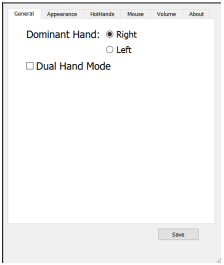
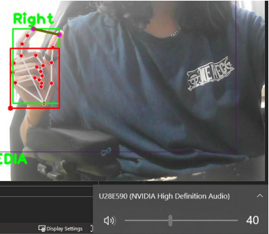
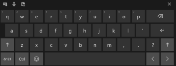

# Hand Gesture Controlled Interface

## Overview

This project implements a hand gesture-controlled interface using MediaPipe for hand tracking and OpenCV for computer vision tasks. The software allows users to control the mouse, keyboard, media keys, and also includes a speech-to-text feature.

## Design

### Assumptions
1. The user has a camera connected to the main device.
2. The user has a microphone connected to the main device or the camera has a built-in microphone.
3. Random noise may cause interruptions in hand recognition.
4. The user possesses at least one hand.

### Tools & Technologies Used
- **Python**: Chosen for its suitability in computer vision tasks.
- **OpenCV**: Utilized for image processing and computer vision tasks.
- **MediaPipe Framework**: Used for building machine learning pipelines, particularly for hand tracking.
- **Other Libraries**: NumPy, time, math, threading, PyQt5, SpeechRecognition, etc.

### Design Decisions
1. Customizable mouse click gesture for a user-friendly experience.
2. Utilized Windows on-screen keyboard feature for text input, providing a familiar experience.
3. Introduced speech recognition for text input, offering faster input than on-screen keyboard.
4. Settings are amendable through a settings text file.
5. Icons and mode selection presented on top of the camera feed for ease of use.

## Usage

1. Ensure your camera and microphone are connected.
2. Run the application.
3. Use hand gestures to control the interface.
4. Explore different modes like mouse control, keyboard input, media keys, and speech-to-text.
5. You can customise how you want the recognition to act, which is your dominant hand etc all by first running the OpenSettings.py file and saving the settings once desired changes have been made
6. To start the software run the Real-Time-HTI.py file after maybe a slow delay you should see the software pop up.
7. Using your fingers and selection method you've set from the settings select one of the icons at the top to perform that task.

## Screenshots

